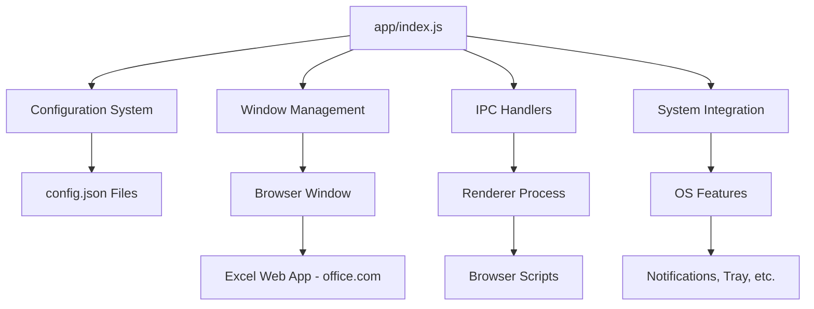

# GitHub Copilot Instructions for Excel for Linux

> [!NOTE]
> **This is a quick reference for GitHub Copilot.**
> - **Claude Code Instructions**: See `CLAUDE.md` in the root directory for detailed code patterns and AI agent workflows

## Project Overview

Excel for Linux is an Electron-based desktop application that wraps the Microsoft Excel web app (office.com), providing a native desktop experience for Linux users with enhanced features like custom CSS, system notifications, and desktop integration.

## Quick Reference

### Essential Commands

```bash
npm start              # Development mode with trace warnings
npm run lint          # ESLint validation (mandatory before commits)
npm run test:e2e      # End-to-end tests with Playwright
npm run pack          # Development build without packaging
npm run dist:linux    # Build Linux packages (AppImage, deb, rpm, snap)
```

### Key File Locations

- **Entry Point**: `app/index.js` - Main Electron process
- **Configuration**: `app/appConfiguration/` - Centralized configuration management
- **Main Window**: `app/mainAppWindow/` - BrowserWindow and Excel web wrapper
- **Browser Scripts**: `app/browser/tools/` - Client-side injected scripts

### Code Standards

- ❌ **NO `var`** - Use `const` by default, `let` for reassignment only
- ✅ **Use `async/await`** instead of promise chains
- ✅ **Private fields** - Use JavaScript `#property` syntax for class members
- ✅ **Arrow functions** for concise callbacks
- ✅ **Run `npm run lint`** before all commits (mandatory)

## Project Architecture



## Development Patterns

### Configuration Management
- All configuration managed through `AppConfiguration` class
- Treat config as **immutable after startup**
- Changes via AppConfiguration methods only

### Error Handling & Logging
- Use try-catch blocks in async functions
- Aim for graceful degradation
- Use `electron-log` for structured logging
- **Never log PII** (URLs, emails, tokens)

### IPC Communication
- Use `ipcMain.handle` for request-response patterns
- Use `ipcMain.on` for fire-and-forget notifications
- All IPC channels must be in the allowlist: `app/security/ipcValidator.js`

### Defensive Coding
- Browser scripts must be defensive - the Excel web app DOM can change without notice
- Implement proper null checks and error handling
- Test across different platforms when possible

## Testing & Quality

- **Linting**: Run `npm run lint` before commits (mandatory)
- **E2E Tests**: Run `npm run test:e2e` - each test uses clean state
- **Manual Testing**: Use `npm start` for development testing
- **CI/CD**: GitHub Actions validates all PRs

## External Dependencies

- **Core**: Electron, electron-builder
- **System**: @homebridge/dbus-native (Linux desktop integration)
- **Storage**: electron-store (persistent configuration)
- **Audio**: node-sound (optional, for notification sounds)

---

**Remember**: Always consider cross-platform compatibility. The Excel web app interface can change independently of this application.
